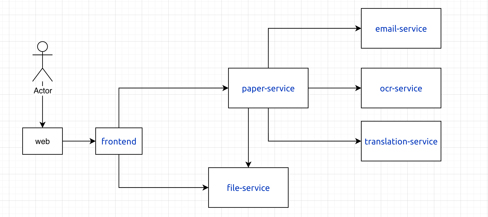

# paper-translation

## 调用关系图



## 使用技术

- etcd
- mongo
- redis
- aliyun oss
- aliyun ocr
- 讯飞大模型
- go-micro
- wire

## 项目结构

```
api         protobuf 定义
app         service实现
build       dockerfile
pkg         通用工具
config      配置文件
docs        文档
Makefile    构建脚本
docker-compose.yml  docker-compose配置文件
```

## 文档

- 后端部署文档 ``docs/deploy.md``
- 开发文档 ``docs/development.md``
- 网关部署文档 ``docs/gateway.md``
